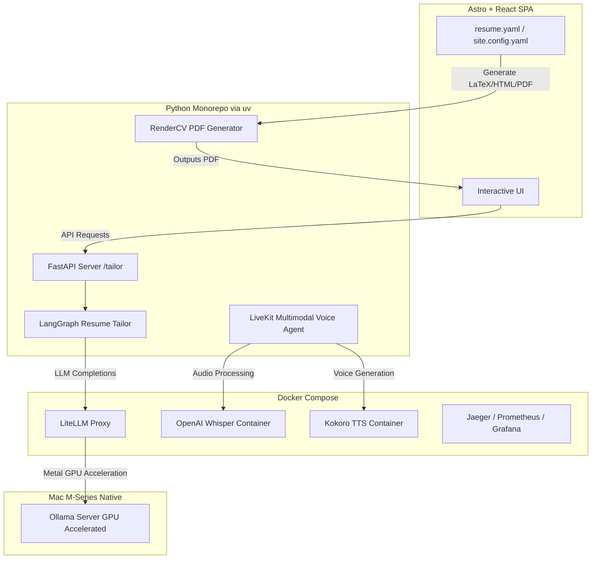

# Technical Architecture

This document provides a comprehensive overview of the portfolio, backend services, and automated testing frameworks of Alexander McIntosh’s interactive portfolio & resume generator.



---

## 1. Directory Structure

The repository is structured as a monorepo containing distinct execution environments:

```text
mcintalmo.github.io/
├── docs/                      # Onboarding and handoff documentation
├── frontend/                  # Astro + React 19 + TypeScript + Tailwind SPA
├── backend/                   # Python monorepo managed via uv workspace
│   ├── common/                # Shared helper libraries and base classes
│   ├── auth/                  # Authentication utilities
│   ├── resume/                # RenderCV-based resume builder & generation scripts
│   ├── tailor/                # FastAPI + LangGraph resume tailoring pipeline
│   ├── agent/                 # LiveKit Multimodal Voice Agent (audio/text)
│   └── mcp/                   # Model Context Protocol servers
├── e2e/                       # Playwright-based Python end-to-end test suite
├── infra/                     # Docker Compose configurations, Makefile, and systemd files
└── tools/                     # Utility CLI tools (RAG, LinkedIn sync, MCP servers)
```

---

## 2. Core Components

### A. Frontend (Interactive Portfolio)
- **Technology Stack**: Astro, React 19, Framer Motion, Tailwind CSS.
- **Data-Driven Resume**: Reads structured YAML data (`src/content/resume.yaml` and `src/content/site.config.yaml`) and compiles them into the layout dynamically.
- **Dynamic Assets**: Pulls down the pre-built PDF resume generated by the backend's Resume Builder component.

### B. Resume Builder (`backend/resume`)
- **Technology Stack**: Python, `rendercv`, LaTeX (XeLaTeX).
- **Function**: Takes `src/content/resume.yaml`, validates it against the schema, and compiles it into:
  - LaTeX (`tools/pdf_generator/output/resume.tex`)
  - HTML preview (`tools/pdf_generator/output/resume.html`)
  - A clean PDF copy copied to `public/downloads/` for the web interface.

### C. Resume Tailoring Service (`backend/tailor`)
- **Technology Stack**: Python, FastAPI, LangGraph.
- **Function**: Accepts a base resume and a job description. Uses a LangGraph state chart to analyze alignment, perform refinement passes, and return a tailored JSON resume and cover letter.
- **State management**: Tailoring graph state tracks the job analysis, extraction nodes, and LLM editing loops to guarantee target formatting.

### D. Voice Agent (`backend/agent`)
- **Technology Stack**: Python, LiveKit Agents SDK, Multimodal API.
- **Function**: A real-time conversational voice agent that serves as an interactive portfolio assistant.
- **Dependencies**: Uses local containerized speech-to-text (Whisper) and text-to-speech (Kokoro) to process audio streams and output responses locally.

---

## 3. Infrastructure & LLM Routing

To avoid vendor lock-in and keep LLM usage local and cost-effective, the project uses a hybrid local/cloud routing system:

- **LiteLLM Proxy**: Coordinates LLM completion requests from the backend to various targets. It standardizes input/output formats and maps models cleanly.
- **Ollama Host Routing**: Containerized Ollama cannot leverage Apple Silicon GPU acceleration on macOS. To solve this, Docker containers route requests to the host at `http://host.docker.internal:11434`, targeting a natively-installed Ollama instance utilizing Apple Metal.
- **Staging (OCI VM)**: For deployments on Oracle Cloud Infrastructure (OCI), Linux handles GPU passthrough natively. Ollama runs containerized with CUDA/ROCm acceleration enabled.
- **Observability**: A complete OpenTelemetry stack is orchestrated through Docker Compose in `infra/` (Jaeger, Prometheus, OpenTelemetry Collector) to trace requests through FastAPI and LangGraph nodes.
